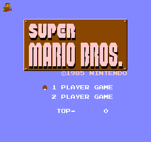

# Super Mario Bros - Kotlin Port

This is an attempt to port Super Mario Bros to readable, modifiable, and proper Kotlin, while retaining full accuracy to the original's physics, look, and intent.

Note that we won't be emulating the various limitations of the NES.

The port includes *every single line of the disassembly* as comments, next to their equivalent Kotlin code or explanations of how they aren't relevant anymore.

One day, when this is runnable, you will be able to use a SMB rom to play on your computer.

## Samples

```kotlin
fun System.nonMaskableInterrupt() {
    //> NonMaskableInterrupt:
    //> lda Mirror_PPU_CTRL_REG1  ;disable NMIs in mirror reg
    //> and #%01111111            ;save all other bits
    //> sta Mirror_PPU_CTRL_REG1
    ram.mirrorPPUCTRLREG1.nmiEnabled = false

    //> and #%01111110            ;alter name table address to be $2800
    //> sta PPU_CTRL_REG1         ;(essentially $2000) but save other bits
    ppu.control.access.value = ram.mirrorPPUCTRLREG1.access.value
    ppu.control.baseNametableAddress = 2

    //> lda Mirror_PPU_CTRL_REG2  ;disable OAM and background display by default
    val tempReg2 = PictureProcessingUnit.Mask(object : ByteAccess {
        override var value: Byte = 0
    })
    tempReg2.access.value = ram.mirrorPPUCTRLREG2.access.value
    //> and #%11100110
    tempReg2.spriteEnabled = false
    tempReg2.backgroundEnabled = false
    
    //...
}
```

```kotlin
class GameRam {
    val wholeBlock = ByteArray(0x800)
    //...
    var savedJoypad1Bits: Byte by Access(0x6fc)
    var savedJoypad2Bits: Byte by Access(0x6fd)
    var joypadBitMask: Byte by Access(0x74a)
    var joypadOverride: Byte by Access(0x758)
    var aBButtons: Byte by Access(0xa)
    var previousABButtons: Byte by Access(0xd)
    var upDownButtons: Byte by Access(0xb)
    var leftRightButtons: Byte by Access(0xc)
    var gameEngineSubroutine: Byte by Access(0xe)
    val mirrorPPUCTRLREG1 = PictureProcessingUnit.Control(Access(0x778))
    val mirrorPPUCTRLREG2 = PictureProcessingUnit.Mask(Access(0x779))
    //...
}
```

## Purpose

- to learn 6502 assembly programming better 
- compare assembly to full programming languages
- create extreme moddability for the game, enabling access of resources beyond the NES
- have super-accurate physics to the original game to better support speedrunners

## Progress



*Above: Output of a unit test running the DrawTitleScreen subroutine (translated), GroundPaletteData, MushroomIconData, and a set of four test sprites making up small mario jumping in the top left*

Each phase will remain its own branch, as each is interesting and usable in its own right.

- Phase 1 - Readable and Running
  - [ ] Port the assembly (at 3,301 lines out of 16,352 lines, 20%)
  - [X] Extract character ROM data
  - [X] Emulate the PPU
    - Seems to be mostly complete, renders to Skiko, probably way too inefficient.  Need to check scroll behaviors.
  - [ ] Emulate the APU
  - [ ] Emulate the Joypads
- Phase 2 - Organized
  - [ ] Organize the top level functions and game RAM block into classes
- Phase 3 - Un-NES
  - [ ] Remove complications that only exist to support the PPU and other limitations of the NES

## Mod Ideas for when we're done

- Super Mario Bros 4k - keeping the original resolution of the graphics, fit the vast majority of the game's levels onto a single 4k display.  Who needs scrolling?
- SMB1+2J Flow - Run without interruption through both SMB1 and SMB2J.
- Procedural level generation - Generate full new levels without the limitation of the NES, enabling us to use complex techniques
- Speedrunners - Multiplayer, players left behind lose. 

## Decisions

- We don't care about emulating the visual limitations of the NES's PPU, nor the complicated logic for juggling updates to it.  We're just going to directly update things as needed.
  - This will yield some inaccuracies in RAM.
  - This will eliminate visual glitches from the original.  Boo hoo.
  - This will make the game run faster.  Yay!
  - This will enable modders to do things beyond the original NES.