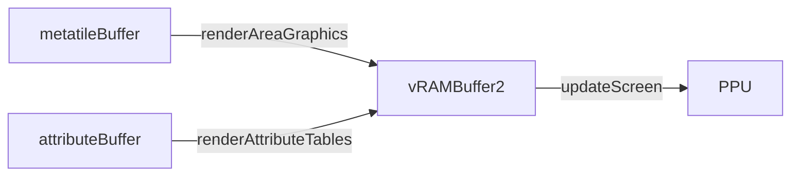

# Graphics

What I've learned about how the graphics are rendered so far.

## Sprites

The easy part.  You just say where you want them on the screen in their own format.  Easy.

## Backgrounds

HOOO BOY.

